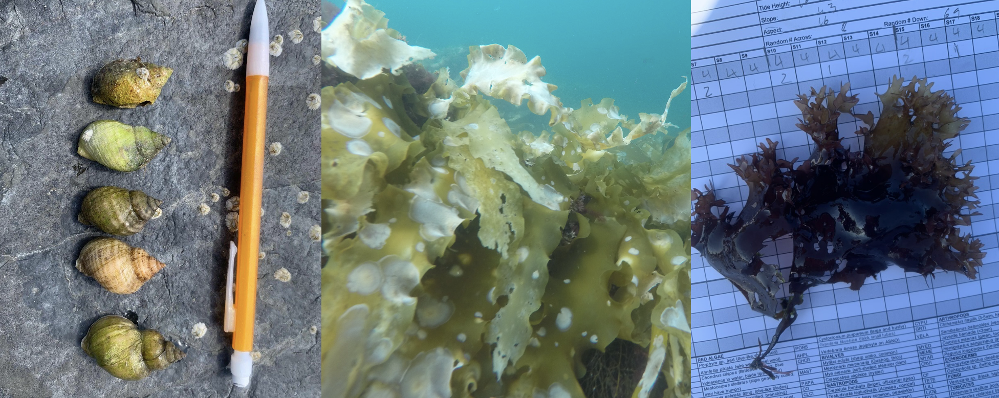

[

  
This page contains brief species identifications and codes used for data recording in the field for all species sampled by the Coastal Ecology for a Living Planet lab. Please use it for reference as a rough field ID guide, although it is likely incomplete. We will note which species cannot be identified in the field where needed.
